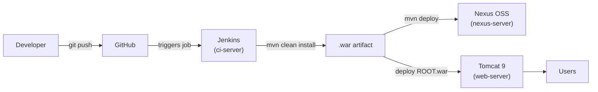
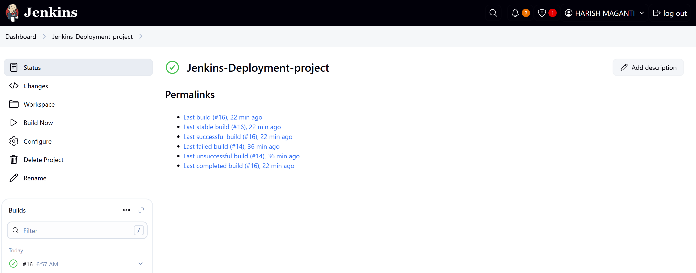
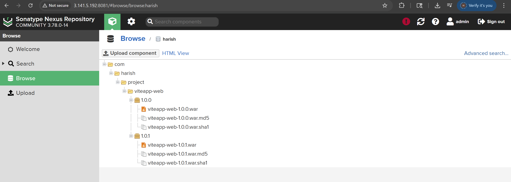
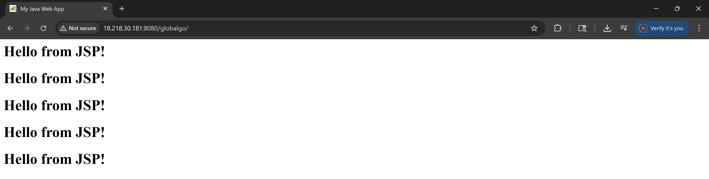

# CI/CD Pipeline — Java Web App with Jenkins, Nexus & Tomcat

An end-to-end CI/CD pipeline that builds a Java web application with Maven, publishes the versioned artifact to a **Nexus** repository, and deploys it to **Apache Tomcat** — orchestrated by **Jenkins** across a three-server AWS EC2 setup.


---

## Architecture



The pipeline spans three AWS EC2 Linux instances, each with a single responsibility:

| Server | Role | Stack |
|---|---|---|
| `ci-server` | Continuous integration | Jenkins, Maven, Java 17 |
| `nexus-server` | Artifact repository | Nexus OSS 3 (maven2 hosted) |
| `web-server` | Deployment host | Apache Tomcat 9 |

---

## Pipeline

Defined in the [`Jenkinsfile`](./Jenkinsfile) — three stages:

| Stage | Command | Result |
|---|---|---|
| **Build** | `mvn clean install` | Compiles the app and packages a `.war` |
| **Publish** | `mvn deploy` | Pushes the versioned artifact to the Nexus hosted repo |
| **Deploy** | copy `.war` → `/opt/tomcat/webapps/ROOT.war` | Tomcat auto-deploys the app at the web root |

**Release flow:** bump the version in `pom.xml` (e.g. `1.0.0 → 1.0.1`) → commit and push → Jenkins builds the artifact → Nexus stores it → Tomcat serves it. Nexus is configured with an *Allow Redeploy* policy so iterative builds can republish.

---

## Tech stack

**CI/CD:** Jenkins · Maven · Git/GitHub
**Artifacts:** Nexus Repository Manager 3
**Runtime:** Apache Tomcat 9 · Java 17
**Infra:** AWS EC2 (3× Amazon Linux)
**App:** Java + JSP web app packaged as a WAR

---

## Results

Verified end-to-end runs (screenshots in [`Results/`](./Results)):

| Jenkins build | Nexus artifact | Tomcat deploy |
|---|---|---|
|  |  |  |

---

## Repository layout

```
.
├── src/main/java/com/harish/project/HelloController.java
├── src/main/webapp/index.jsp
├── pom.xml            # Maven build + WAR packaging
├── Jenkinsfile        # 3-stage pipeline
└── Results/           # verification screenshots
```

---

## Possible next steps

Natural extensions that would take this from a foundational pipeline toward a production-grade one:
- **Quality gate** — add a SonarQube stage between build and publish
- **Containerize** — build a Docker image and deploy to ECS/EKS instead of copying a WAR
- **Webhook trigger** — replace polling with a GitHub webhook for instant builds
- **Credentials** — move Nexus/Tomcat auth into the Jenkins credentials store

---

## Author

**Harish Maganti** — Cloud & DevOps Engineer
[LinkedIn](https://linkedin.com/in/harishmaganti) · [GitHub](https://github.com/Harishmaganti2) · harish@harishmaganti.com
